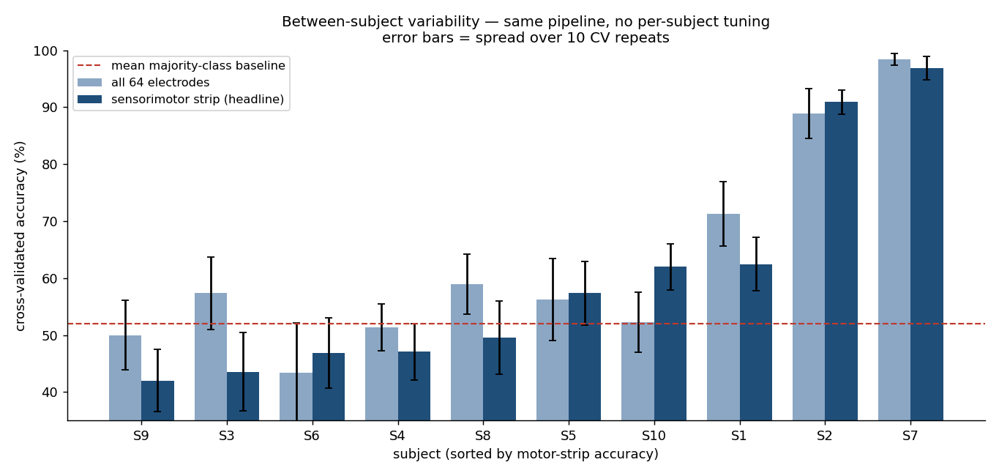
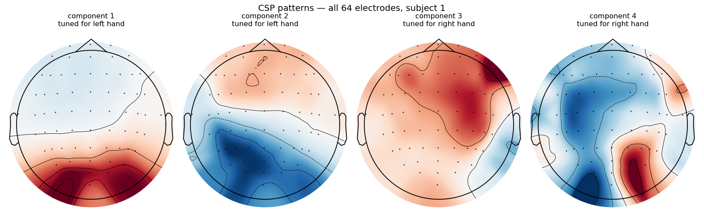
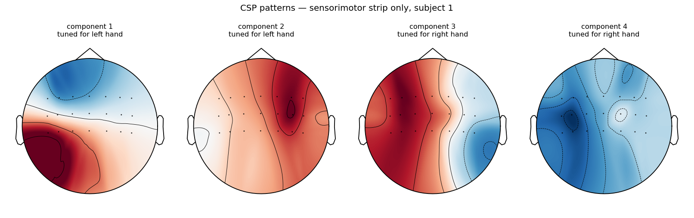
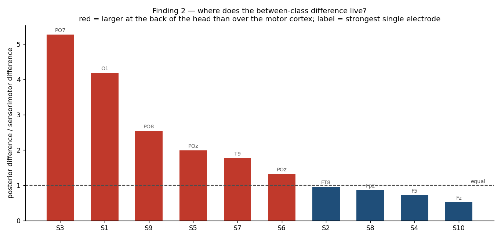
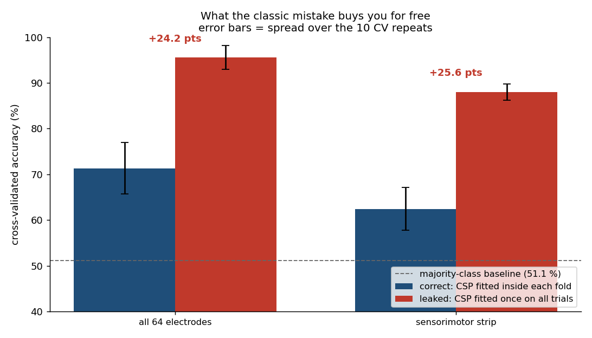
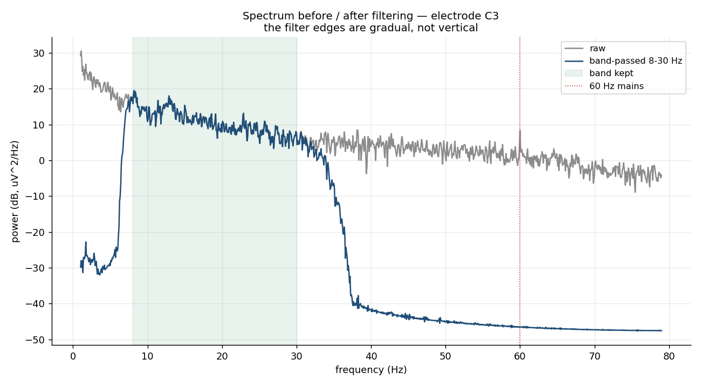
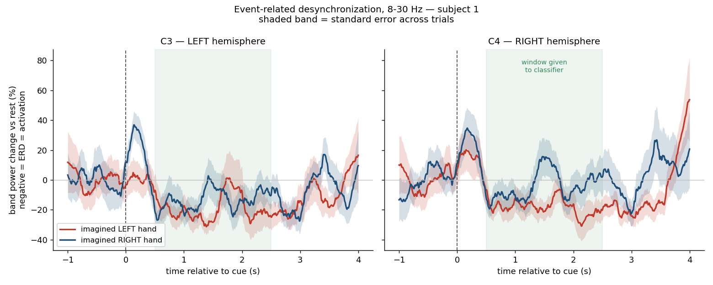
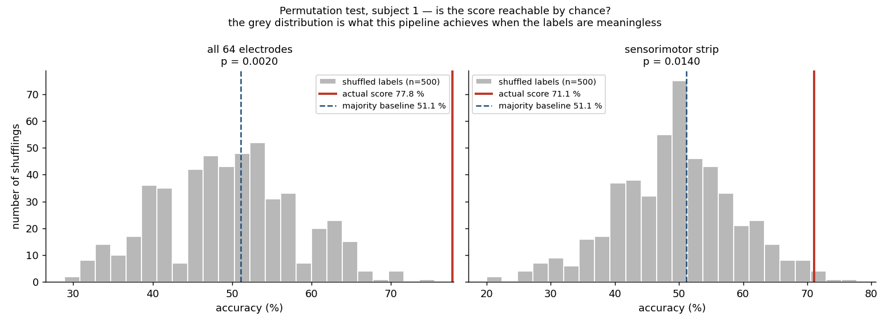

# EEG Motor Imagery — left vs right hand classification (CSP + LDA)

Decoding imagined left-hand vs right-hand movement from scalp EEG, on the public
[PhysioNet EEG Motor Movement/Imagery](https://physionet.org/content/eegmmidb/1.0.0/)
dataset, using the standard pipeline of the field: **band-pass filtering →
epoching → CSP → LDA → cross-validation**. No deep learning — the point is to
handle real EEG with the standard tools (MNE-Python, scikit-learn) and to read
the results honestly.

**The honest summary in one line:** on 10 subjects with identical parameters,
**3 out of 10 are decodable above chance**, the median subject sits 1.4 points
above the majority baseline, and **not one subject's strongest discriminative
electrode lies over the motor cortex.**

That last sentence is the project. A version of this repo that reported "62 %
accuracy" and stopped would have been easier to write and would have been
misleading.

📓 **[METHODOLOGY.md](METHODOLOGY.md)** is the companion document: what was done at
each step, why, how each choice was reached, and a running log of the 19 times a
check contradicted what we believed. Read it if you care about the reasoning
rather than the result.

---

## Results

### Ten subjects, one pipeline, nothing re-tuned



| | Sensorimotor strip (headline) |
|---|---|
| mean | 59.9 % |
| **median** | **53.4 %** |
| mean without the top 2 subjects | **51.4 %** |
| mean majority-class baseline | 52.0 % |
| best / worst subject | 96.9 % / 42.0 % |
| **subjects above chance (p < 0.05)** | **3 / 10** |

**Read the median, not the mean.** Removing the two best subjects puts the
pipeline *at chance*. Two people out of ten carry the entire average, so quoting
59.9 % as "the accuracy of this method" would describe a decoder that does not
exist for the other eight.

This is not a broken pipeline — it is what motor imagery looks like. "BCI
illiteracy", the documented finding that 15–30 % of healthy subjects produce no
decodable imagery, predicts exactly this shape. The 55-point spread between best
and worst subject is also the clearest possible argument for per-person
calibration.

<details>
<summary>Per-subject table</summary>

| Subject | Trials | Baseline | All 64 | Motor strip | p (motor) | post/motor | Peak electrode |
|---|---|---|---|---|---|---|---|
| S1 | 23/22 | 51.1 % | 71.3 ± 6 | 62.4 ± 5 | 0.020 | 4.2 | O1 |
| S2 | 23/22 | 51.1 % | 88.9 ± 4 | **90.9 ± 2** | 0.005 | 1.0 | FT8 |
| S3 | 23/22 | 51.1 % | 57.3 ± 6 | 43.6 ± 7 | 0.960 | 5.3 | PO7 |
| S4 | 23/22 | 51.1 % | 51.3 ± 4 | 47.1 ± 5 | 0.537 | 0.7 | F5 |
| S5 | 21/24 | 53.3 % | 56.2 ± 7 | 57.3 ± 6 | 0.179 | 2.0 | POz |
| S6 | 24/21 | 53.3 % | 43.3 ± 9 | 46.9 ± 6 | 0.587 | 1.3 | POz |
| S7 | 23/22 | 51.1 % | 98.4 ± 1 | **96.9 ± 2** | 0.005 | 1.8 | T9 |
| S8 | 22/23 | 51.1 % | 58.9 ± 5 | 49.6 ± 6 | 0.438 | 0.9 | Fpz |
| S9 | 24/21 | 53.3 % | 50.0 ± 6 | 42.0 ± 5 | 0.851 | 2.5 | PO8 |
| S10 | 24/21 | 53.3 % | 52.2 ± 5 | 62.0 ± 4 | 0.184 | 0.5 | Fz |

± is the spread over 10 cross-validation repeats. `p` from 200 label shufflings.
Subject 1 was analysed in more depth in step 6 with 500 shufflings, giving
p = 0.014.

</details>

---

## Three things this project actually found

### 1. The highest score was not the best result

Two electrode sets were compared on every subject: all 64 electrodes, and the 21
of the sensorimotor strip. All 64 scores higher — 71.3 % vs 62.4 % on subject 1,
+2.9 points on average across subjects. But its CSP spatial patterns are not
motor:




The top row is all 64 electrodes: component 1 puts 12 % of its weight on the
motor strip and peaks at **O1**, an occipital electrode. The bottom row is the
restricted version: peaks at CP5, **C4**, FC3 and **C3**, over the sensorimotor
cortex, with component 3 showing a clean left-vs-right map.

**So the confound does not degrade accuracy — it improves it.** That is what makes
it dangerous. A project reading only the score would report 71.3 % and claim to
have decoded motor imagery. Only the patterns expose it.

The headline result of this repo is therefore the **lower** number. Not out of
modesty — out of generalisation. The extra 8.9 points come from activity that
correlates with the class *in this protocol* (a target on a screen, gaze,
attention, blinks). Change the protocol and that signal has nothing to attach to.
It is the classifier that separates left-handers from right-handers by spotting
the wristwatch: the score is real, reproducible, and worthless the moment someone
wears their watch on the other wrist. Cross-validation measures reproducibility
under resampling; it cannot measure reproducibility under a change of conditions.
Full argument in [METHODOLOGY.md](METHODOLOGY.md#why-the-higher-score-is-not-the-headline-result).

### 2. Across all 10 subjects, the strongest discriminative electrode is never motor

| Family of the peak electrode | Count | Subjects |
|---|---|---|
| posterior (visual / attention) | 5 / 10 | S1 S3 S5 S6 S9 |
| **sensorimotor (what we want)** | **0 / 10** | — |
| temporal (jaw / neck muscle, EMG) | 2 / 10 | S2 S7 |
| frontal (eye movement, EOG) | 3 / 10 | S4 S8 S10 |



And the cross-check that matters most: **the two subjects carrying the entire
group average (S7 at 96.9 %, S2 at 90.9 %) are also the only two peaking at a
temporal electrode** — a site that picks up jaw and neck muscle activity, and EMG
extends into the upper part of our 8–30 Hz band.

This does not prove those results are muscle: their motor-strip accuracy is high
on its own, and lateral strip channels sit close to temporal sites. But the two
strongest results in the study are the two where a non-brain explanation is most
available, and a group mean reported without that caveat would mislead. Settling
it needs EMG-specific diagnostics (high-frequency power, ICA components) —
outside this project's scope, and logged as the most valuable next check.

### 3. One line in the wrong order is worth 25 accuracy points

CSP is a **supervised** transform. Fitting it once on all the data and then
cross-validating only the classifier leaks the test labels into the features —
a mistake common in tutorials, and invisible in the resulting number.



| Variant | Correct (CSP inside each fold) | Leaked (CSP fitted once) | Free gain |
|---|---|---|---|
| all 64 electrodes | 71.3 % | 95.6 % | **+24.2 pts** |
| sensorimotor strip | 62.4 % | 88.0 % | **+25.6 pts** |

Every pipeline in this repo is a scikit-learn `Pipeline` — not for elegance, but
because a `Pipeline` makes the correct order structurally unavoidable.

---

## Method

Each step has a script, a text report in `results/`, and a section in
[METHODOLOGY.md](METHODOLOGY.md).

| Step | Script | What it does |
|---|---|---|
| 2 | `01_explore_raw.py` | Download, then verify every assumption against the real files |
| 3 | `02_filter.py` | 8–30 Hz zero-phase FIR band-pass, measured rather than trusted |
| 4 | `03_epochs.py` | Cut into 45 trials, quantify ERD, hunt confounds |
| 5 | `04_csp.py` | CSP in 3 variants; patterns used as a diagnosis |
| 6 | `05_classify.py` | LDA, confusion matrix, permutation test, leakage measurement |
| 7 | `06_all_subjects.py` | The whole thing on 10 subjects |

**The data.** 64 electrodes, 160 Hz, runs 4/8/12 only (imagined movement — see
below), 45 trials per subject: 23 left, 22 right.

**Why 8–30 Hz.** Not convention — measurement. In the raw signal **78 % of the
power sits below 8 Hz** (drift, sweat, electrode impedance) and the useful mu +
beta band holds 15 %. CSP maximises a *variance* ratio, and variance is power, so
feeding it unfiltered data would optimise on drift. Filtering is what makes CSP
applicable at all.



**What we are looking for.** Not a signal that appears — one that *disappears*.
The sensorimotor cortex oscillates at rest; imagining a movement breaks that
synchronisation on the opposite side of the brain (ERD). Negative means activation:



**Chance is not 50 %.** With 23 vs 22 trials, always answering "left" scores
51.1 %. And on 45 trials the permutation null has a standard deviation of 8.6
points — a pipeline with *no information at all* exceeds 58 % one time in six:



---

## Context and limitations

### Three levels of motor intent, and why they are not interchangeable

When people talk about "decoding the intention to move" from EEG, three very
different experimental paradigms often get conflated. They do not produce the
same signal, the same decoding quality, or the same clinical usefulness.

| | Paradigm | What the person does | Cortical signal | Usable to train a BCI for a paralysed person? |
|---|---|---|---|---|
| **1** | **Executed movement** | Actually moves the hand | Strongest — but contaminated | **No** |
| **2** | **Attempted movement** | Genuinely tries to move; nothing moves (paralysis, or movement blocked experimentally) | Strong, close to real intent | **Yes** — the clinical-trial paradigm |
| **3** | **Motor imagery** | Mentally rehearses without trying to execute | Weakest and most variable | Yes, but further from the use case |

**Level 1 — executed movement.** The cleanest signal of the three, for two reasons
that are exactly the problem. The movement itself generates electricity — muscle
contractions, head micro-movements, cable motion — and those artifacts are
*correlated with the class*, so a classifier can score well by learning the muscle
instead of the cortex. And an executed movement produces sensory feedback that
re-activates cortex, so part of what is decoded is the movement's *consequence*,
not its command. Above all: **a paralysed person can never produce this signal.**
That is why this project does not use runs 3/7/11 despite their more flattering
accuracy.

**Level 2 — attempted movement.** A genuine motor command, blocked downstream at
the lesion. The motor cortex activates for real. This is the paradigm of implanted
BCI trials — BrainGate participants are told to *attempt* to move, not to imagine
— and the logic of the work publicly presented by Benjamin Rapoport (Precision
Neuroscience). No movement artifact, and an authentic intention rather than a
simulation.

**Level 3 — motor imagery.** What this project does. Sensorimotor activation does
occur, which is what makes decoding possible, but it is weaker, more variable
trial to trial, and far more variable across people. Everything in the Results
section is a consequence of that.

This three-level hierarchy is directly illustrated by a public demonstration from
Precision Neuroscience: participant Jasaun, implanted with the company's
non-penetrating Layer 7 cortical array, first calibrated the system by moving a
joystick with his hand (executed movement) while the array recorded the
corresponding neural activity. The joystick was then disconnected, and cursor
control continued through decoded neural signal alone — with Jasaun still
physically moving his hand, illustrating the boundary between executed movement
and pure neural decoding. Notably, the Layer 7 array achieves this without
penetrating brain tissue, and was fully removed after the study. (Source:
Precision Neuroscience, ["What a neurosurgeon looks for in a BCI: high resolution
without tissue injury"](https://www.youtube.com/watch?v=S_hiCzHuhCs), 2026.)

### The dataset's trap

PhysioNet's 14 runs per subject are not the same task:

| Runs | Task |
|---|---|
| 3, 7, 11 | **executed** movement, left / right hand (level 1) |
| **4, 8, 12** | **imagined movement, left / right hand (level 3)** ← used here |
| 5, 9, 13 | **executed** movement, both fists / both feet (level 1) |
| 6, 10, 14 | imagined movement, both fists / both feet (level 3) |

Confusing them is the classic mistake on this dataset: accuracy comes out markedly
higher on executed movement, and one believes motor imagery was decoded.

### Calibration: why the model is fitted per person

Motor imagery signals differ enormously between people, and from trial to trial
within one person. Two consequences run through the project:

- **The model is trained individually**, on each person's own examples. A shared
  decoder would average over patterns that genuinely differ and describe nobody
  well — the 55-point spread in the Results section is that argument, measured.
- **The model is statistical, not a threshold.** CSP + LDA learn an average pattern
  and classify each trial by which distribution it more likely came from. A rule
  like "if power at C3 drops below X, call it right hand" would be right for a few
  trials and wrong for the rest.

Real BCIs handle this with a **calibration phase**: before use — often at the start
of every session — the person performs a few dozen trials whose intended action is
known, so the system can fit to that person's signal first. The 45 trials here play
exactly that role.

### What this project cannot claim

1. **The paradigm is not the use case.** A real assistive system decodes an
   *attempted* movement (level 2), not voluntary imagery (level 3). Nothing
   guarantees a decoder trained on one works on the other.
2. **The subjects are healthy.** After a spinal cord injury or stroke the motor
   cortex reorganises; spatial maps learned on healthy subjects do not transfer
   as-is.
3. **Cued, two-class, offline.** We tell the subject when to imagine, then choose
   between two answers, then analyse afterwards. A real BCI runs continuously and
   must handle the dominant real-life case: the user commanding nothing at all.
4. **Within-session only.** Train and test come from the same recording session.
   Cross-validation guarantees no trial is tested on a model that saw it, but there
   is no day-1-to-day-2 test — and session transfer is where BCIs lose the most.
5. **The mechanism is not demonstrated.** The decoder works for 3 of 10 subjects,
   and in no subject does the strongest discriminative electrode sit over the motor
   cortex. We can show decoding; we cannot show it is motor.

---

## Long-term vision

This repo is brick 1 of a longer trajectory. The question worth reaching is not
"left or right?" but:

> **Can a genuine attempt at a motor command (level 2) be distinguished from plain
> mental imagery with no intent to command (level 3) — and from the absence of any
> command?**

A cursor, wheelchair or prosthesis driven by intent alone needs three things in
order: *does the user want to command anything right now?*, then *what?*, and above
all *do nothing when the answer to the first is no*. A two-class classifier forced
to answer "left" or "right" at every instant is unusable — it emits a command
continuously, including while the user is thinking about lunch.

**a) Add a "rest / idle" class.** Feasible without changing dataset: the annotations
contain rest periods (`T0`) — verified on the real files, 45 events of 4.2 s,
balanced against the 45 imagery trials. Going from 2 to 3 classes requires a
confidence threshold and a notion of rejection rather than an argmax. First step
towards a decoder that knows how to stay silent.

**b) Move to *attempted movement* data.** The real qualitative jump, and it needs a
different dataset. The most direct lead is the literature on attempted movements in
people with spinal cord injury (see Ofner et al., *Scientific Reports*, 2019, on
decoding attempted movements from low-frequency EEG in SCI patients); such datasets
are hosted by repositories like BNCI Horizon 2020. Two caveats: these cohorts are
small, and the level 2 / level 3 distinction is mostly documented invasively.

Note the direct consequence for the method: that literature works at **0.3–3 Hz**,
the band our 8 Hz high-pass deliberately discards. 8–30 Hz is right for level 3, not
universally right.

**Where this distinction is actually established today.** Separating a genuine
attempt from plain imagery is better documented on **invasive recordings** — ECoG on
the cortical surface, or intracortical electrodes of the BrainGate type — than on
scalp EEG. The reason is physical: in EEG the signal crosses meninges, skull and
scalp, which attenuate it and *spatially blur* it, each electrode summing several
square centimetres of cortex. Invasively you are on the other side of that barrier:
far better signal-to-noise, millimetre resolution, access to the high frequencies
the skull crushes. This project deliberately stays on scalp EEG — non-invasive,
public, sufficient to learn the method. Exploring the same question on public
invasive data one day would be the logical continuation; it is not planned in the
short term and nothing here depends on it.

---

## Reproduce

```bash
git clone https://github.com/ApolloStun/EEG-Motor-Imagery-CSP.git
cd EEG-Motor-Imagery-CSP
python3 -m venv .venv
source .venv/bin/activate        # Windows: .venv\Scripts\activate
pip install -r requirements.txt
```

Data is not in the repo — it downloads from PhysioNet on first run and caches in
`data/` (7.8 MB per subject, 78 MB for all ten).

```bash
python src/01_explore_raw.py    # download + verify the raw data
python src/02_filter.py         # 8-30 Hz filtering, before/after measurements
python src/03_epochs.py         # cut into trials, ERD, confound hunt
python src/04_csp.py            # CSP: 3 variants, patterns, accuracy
python src/05_classify.py       # LDA + honest CV      (~3 min, 500 permutations)
python src/06_all_subjects.py   # all 10 subjects      (~2 min once cached)
```

Every script writes a plain-text report to `results/` and its figures to
`figures/`. Versions are pinned in `requirements.txt`; the random seed is fixed in
`config.py`, so the numbers above reproduce exactly.

## Structure

```
EEG-Motor-Imagery-CSP/
├── src/
│   ├── config.py            # every parameter of the project, in one place
│   ├── preprocessing.py     # loading, filtering, epoching   (shared from step 3)
│   ├── erd.py               # ERD quantification             (shared from step 7)
│   ├── model.py             # the CSP -> LDA pipeline        (shared from step 6)
│   ├── 01_explore_raw.py    ├─ step 2
│   ├── 02_filter.py         ├─ step 3
│   ├── 03_epochs.py         ├─ step 4
│   ├── 04_csp.py            ├─ step 5
│   ├── 05_classify.py       ├─ step 6
│   └── 06_all_subjects.py   └─ step 7
├── data/                    # EDF downloads (gitignored, regenerable)
├── figures/                 # every figure in this README
├── results/                 # one text report per step, plus a per-subject CSV
├── requirements.txt         # pinned versions
├── METHODOLOGY.md           # the reasoning behind every step
└── README.md
```

The three shared modules each appeared at the moment a *second* script needed the
same code — not before. Factoring out on the first occurrence invents abstractions
for a single use; factoring out on the third leaves you with copies that have
already diverged.

## Where to read next

- **[METHODOLOGY.md](METHODOLOGY.md)** — the full reasoning, step by step, including
  the running log of every time a check contradicted what we believed. Six of those
  entries are bugs found in this project's own code.
- `results/*.txt` — the raw reports each script prints, with every number in this
  README traceable to one of them.
